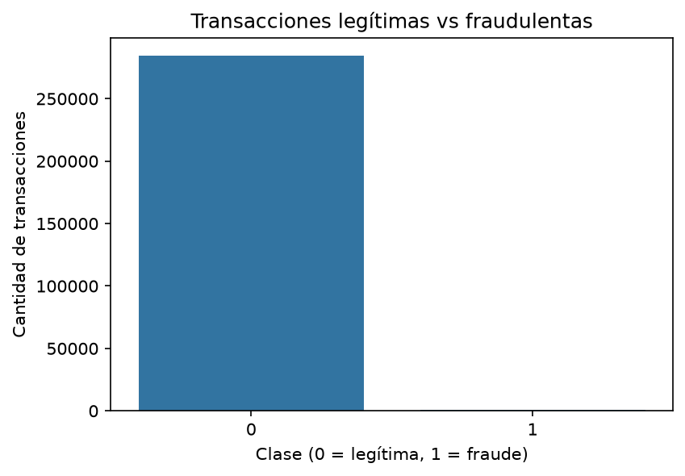
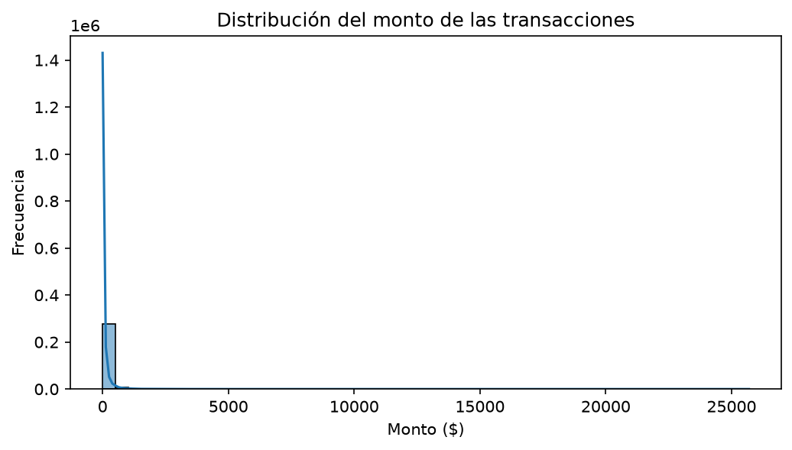
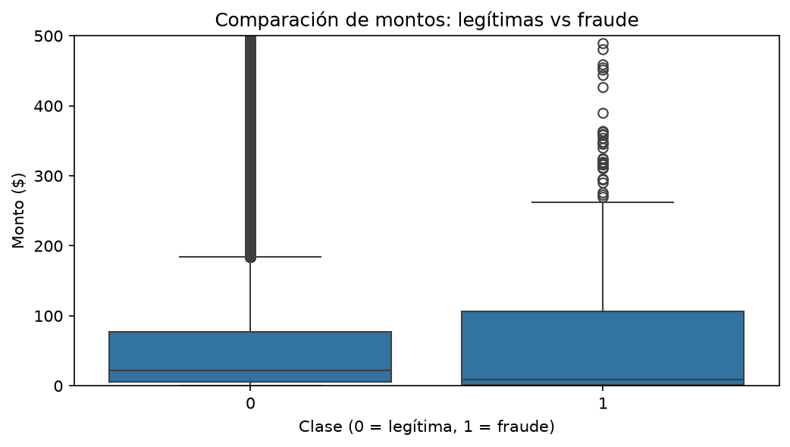
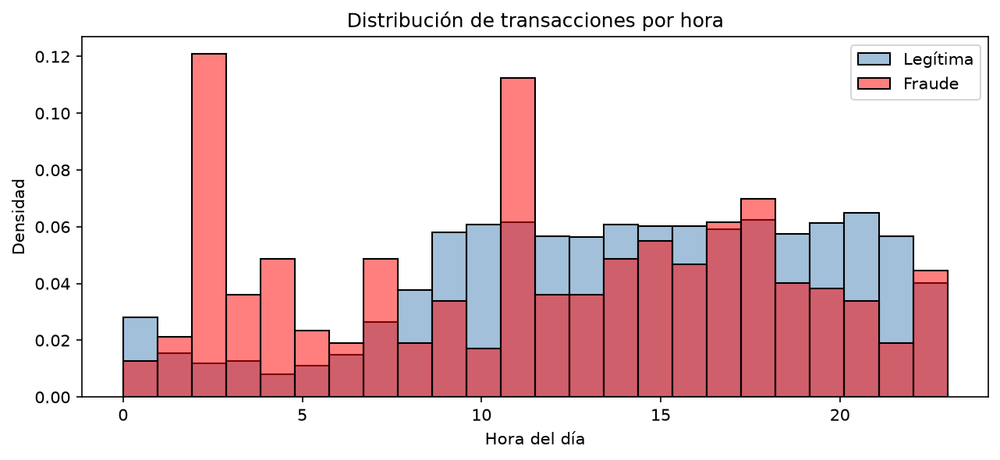
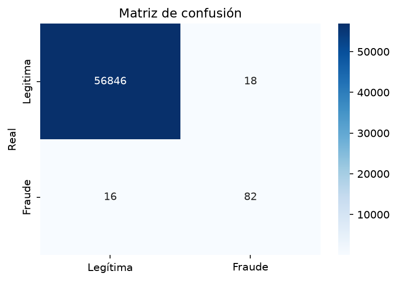
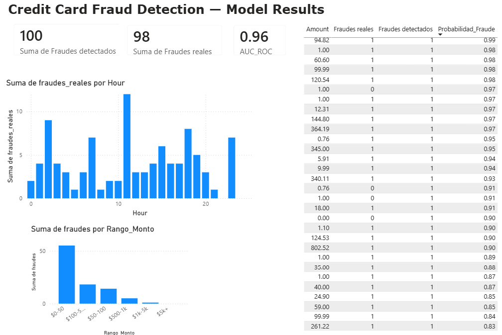

# Credit Card Fraud Detection

Fraud detection system using machine learning on imbalanced transaction data, with SQL data handling and Power BI dashboard visualization.

## Table of contents

- [Project overview](#project-overview)
- [Dataset](#dataset)
- [Tech stack](#tech-stack)
- [Exploratory data analysis](#exploratory-data-analysis)
- [Handling class imbalance](#handling-class-imbalance)
- [Model](#model)
- [Dashboard](#dashboard)
- [Project structure](#project-structure)
- [How to run this project](#how-to-run-this-project)
- [Key findings](#key-findings)


## Project overview

This project builds a fraud detection pipeline on real, anonymized credit card transactions. The main challenge tackled here is **extreme class imbalance**: only 0.17% of transactions in the dataset are fraudulent, which means a naive model could reach 99.8% accuracy while never catching a single fraud case.

The project covers the full workflow: exploratory data analysis, class imbalance handling, model training and evaluation with the right metrics, and a Power BI dashboard for presenting results to a non-technical audience.

## Dataset

- **Source:** [Credit Card Fraud Detection — Kaggle](https://www.kaggle.com/datasets/mlg-ulb/creditcardfraud)
- **Size:** 284,807 transactions, 31 columns
- **Features:** `Time`, `Amount`, and 28 anonymized PCA-transformed features (`V1`–`V28`)
- **Target:** `Class` (0 = legitimate, 1 = fraud)
- **Missing values:** none

| Class | Count | Percentage |
|---|---|---|
| Legitimate (0) | 284,315 | 99.83% |
| Fraud (1) | 492 | 0.17% |

## Tech stack

| Tool | Purpose |
|---|---|
| Python (pandas, scikit-learn) | Data manipulation and modeling |
| matplotlib, seaborn | Exploratory visualization |
| imbalanced-learn (SMOTE) | Class imbalance handling |
| SQL / MySQL | Data storage and querying |
| Power BI | Executive dashboard |
| Jupyter Notebook | Development environment |

## Exploratory data analysis

### Class distribution

The dataset is heavily imbalanced, which is the central challenge addressed throughout this project.



### Transaction amount distribution

Transaction amounts are right-skewed: most transactions are low-value, with a long tail of high-value outliers.



### Amount by class

Fraudulent transactions tend to have higher and more variable amounts than legitimate ones.



### Transactions by hour



*Fraudulent transactions show two anomalous peaks around 2:00 AM and 11:00 AM that do not match the distribution of legitimate activity, suggesting automated or coordinated attack patterns during low-monitoring hours*

## Handling class imbalance

Two complementary strategies were used:

1. **`class_weight='balanced'`** in the model, so misclassifying the minority class is penalized more heavily.
2. **SMOTE (Synthetic Minority Oversampling Technique)**, applied **only to the training set** (never to the test set), to generate synthetic fraud examples and give the model more minority-class patterns to learn from.

```
raw data
   |
   v
train/test split   <- split first
   |
   v
SMOTE on train only   <- balance only the training data
   |
   v
train model
   |
   v
evaluate on original (untouched) test set
```

Accuracy is not used as an evaluation metric here, since it is misleading on imbalanced data. Instead, the model is evaluated with:

- **Precision**: of all transactions flagged as fraud, how many actually were
- **Recall**: of all real fraud cases, how many were caught
- **F1-score**: balance between precision and recall
- **AUC-ROC**: overall ability to separate the two classes

## Model

**Algorithm:** Random Forest Classifier with 100 estimators

**Class imbalance strategy:** SMOTE on training set + `class_weight='balanced'`

| Metric | Legitimate | Fraud |
|---|---|---|
| Precision | 1.00 | 0.82 |
| Recall | 1.00 | 0.84 |
| F1-score | 1.00 | 0.83 |
| **AUC-ROC** | **0.9638** | |



Out of 98 real fraud cases in the test set, the model detected 82 (84% recall),
with only 18 false alarms out of 56,864 legitimate transactions.


## Dashboard

Interactive Power BI dashboard built on top of the model's predictions,
showing key fraud metrics, temporal patterns, and high risk transactions.

 

**Key insights visible in the dashboard:**
- 100 transactions flagged as fraud vs 98 actual fraud cases
- Fraud peaks at hour 11 — consistent with EDA findings
- Most fraud concentrated in the $0–50 and $100–500 amount ranges
- High-risk transaction table filtered to probability > 0.80,
  showing individual transactions with up to 0.99 fraud probability

## Project structure

```
fraud-detection/
├── .gitignore
├── README.md
├── requirements.txt
├── data/         # not tracked in git — download dataset from Kaggle
├── images/
│   ├── 01_class_distribution.png
│   ├── 02_amount_distribution.png
│   ├── 03_amount_by_class.png
│   ├── 04_transactions_by_hour.png
│   ├── 05_confusion_matrix.png
│   └── 06_dashboard_powerbi.png
├── notebooks/
│   └── 01_eda.ipynb
└── src/
```

## How to run this project

```bash
# clone the repo
git clone https://github.com/YOUR-USERNAME/credit-card-fraud-detection.git
cd credit-card-fraud-detection

# install dependencies
pip install -r requirements.txt

# download the dataset from Kaggle and place it in data/
# https://www.kaggle.com/datasets/mlg-ulb/creditcardfraud

# launch Jupyter
jupyter notebook

# the other way 
python -m notebook
```

## Key findings

- The dataset is clean with no missing values across all 31 columns.
- Only 0.17% of transactions are fraudulent (492 out of 284,807), 
  requiring SMOTE and class weighting to handle the extreme imbalance.
- Fraudulent transactions tend to involve higher and more variable 
  amounts than legitimate ones.
- Fraud peaks at hour 11 AM and shows elevated activity in early 
  morning hours (1–4 AM), suggesting automated attack patterns during 
  low-monitoring periods.
- Most fraud concentrates in the $0–50 and $100–500 amount ranges.
- The Random Forest model achieved AUC-ROC of 0.9638, detecting 82 
  out of 98 real fraud cases with only 18 false alarms out of 56,864 
  legitimate transactions.


